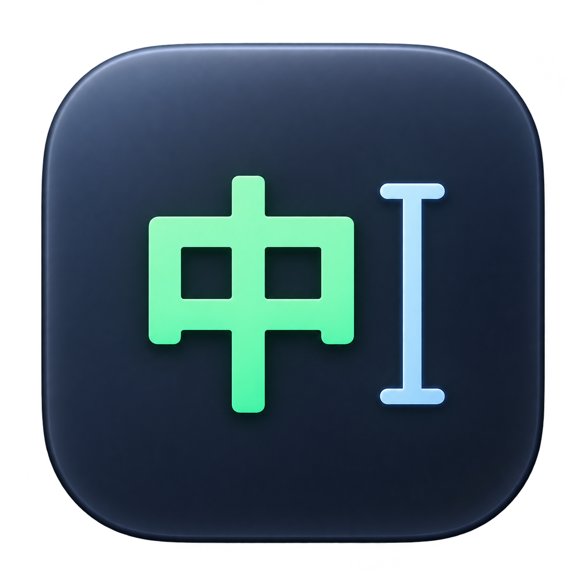

<p align="center"></p>

# DoubaoCaret

[中文](README.md) | **English**

See Doubao IME's **中 / A** mode beside your text caret or mouse while coding.

A native Swift + AppKit macOS menu bar utility with no Dock icon or third-party runtime dependencies. Requires **macOS 13+**; one universal app supports **Apple Silicon and Intel**. The application UI is currently primarily Chinese; this documentation provides English guidance.

> Early-stage software. Caret support depends on each application's accessibility implementation. When reliable bounds are unavailable, the indicator follows the mouse. Full compatibility, mode accuracy, and CPU measurements are still being validated.

## Features

- Observe Doubao's internal Chinese/English mode, beyond the system input source.
- **Caret first + mouse fallback**, or **Follow Mouse** at all times.
- Four corners, with adjustable X/Y offsets in points.
- Separate Chinese/English labels and colors; font size, opacity, optional background and corner radius.
- Live settings preview and automatic persistence.
- A nonactivating, click-through indicator, with intended multi-display, Space and fullscreen support.
- Enable/disable, launch at login, manual calibration, permission repair and copyable diagnostics.

## Download and install

1. Open this repository's **[Releases](../../releases)** and download `DoubaoCaret-v<version>-macos-universal.zip`.
2. Unzip and move `DoubaoCaret.app` into `/Applications`, then open it.
3. In the menu, choose **权限设置与更新修复** (Permissions and update repair). Grant **Accessibility** and **Input Monitoring**.
4. Select Doubao IME. Type pinyin or switch mode with Shift so the indicator can obtain evidence.

The app lives in the menu bar. Settings open on first launch. Quit and reopen the app if macOS asks you to restart after granting permissions.

### macOS blocks the first launch

Check the release's signing description. The default automated release is an **ad-hoc test build, not notarized by Apple**. If you trust the download, attempt to open it, then use **System Settings → Privacy & Security → Open Anyway**. See [Apple's instructions](https://support.apple.com/102445).

### Permissions stop working after an update

A fixed installation path alone cannot preserve permissions across ad-hoc builds. The permission window provides **重新检测权限** (Recheck permissions) and **复制本应用的权限修复命令** (Copy this app's permission repair commands). You must still grant access after resetting it. See [Permissions and signing](docs/PERMISSIONS.en.md).

### Verify a download

Download the ZIP and `SHA256SUMS` from the same release into one directory:

```bash
shasum -a 256 --ignore-missing -c SHA256SUMS
```

The downloaded ZIP should report `OK`. Checksums detect corruption; they do not replace trust in the release source.

## Usage

| Setting | Behavior |
|---|---|
| Caret first | Use reliable insertion bounds from the target app; otherwise follow the mouse |
| Follow Mouse | Follow the pointer without querying the text caret |
| Position | Top left / top right / bottom left / bottom right |
| X / Y Offset | Points; positive values move away from the anchor, negative values move toward/across it |
| Labels / colors / appearance | Configure each mode and see changes immediately |
| Calibrate Chinese / English | Set only the indicator's known state; do not send keys or change the IME |
| Launch at Login | Register the installed app with the system login service |

**`?` means unknown, not English.** Startup, input-source changes, or interrupted events require calibration. Focus changes with the same input source preserve the last known state while rechecking. For other IMEs the indicator hides and the menu shows `—`; secure input also hides the indicator.

## Detection and limitations

The primary evidence is Doubao's accessible “中 / 英” mode tooltip. Recent typing followed by a candidate window provides Chinese evidence; standalone Shift can infer a toggle from a known state. The menu reports the evidence source. **Missing candidates never imply English.** Turn off standalone-Shift inference if Doubao's Shift switching is disabled.

No directly usable public API for Doubao's internal mode has been confirmed. Without accessible tooltips, candidate windows or events, immediate detection cannot be guaranteed. If Doubao restores per-app modes, the retained state after a focus change may need fresh evidence to correct it.

Initial targets are VS Code, Cursor, Terminal/iTerm, Chrome/Safari and JetBrains. **This is a target list, not a verified compatibility guarantee.** VS Code/Cursor accessibility exposure is requested when needed; editor configuration files are not modified.

If the indicator always follows the mouse, check Accessibility permission and Caret-first mode, type in the target app, then choose **复制上次应用的光标诊断** (Copy last app's caret diagnostics) and attach the result to an issue.

## Privacy and performance

The running app has no networking, telemetry or keystroke logging. It does not read text-field contents or the clipboard. It writes the clipboard only when you explicitly copy diagnostics or repair commands. Global input monitoring is listen-only: no injected or swallowed events. AX queries inspect the focus chain and small Doubao tooltip subtrees, not entire accessibility trees at high frequency.

Events are preferred, mouse updates are coalesced to at most 60 per second, caret fallback samples once per second, and idle Doubao window checks run every two seconds. Disable/suspended sessions stop periodic work. CPU and energy use still need measurement; see [Validation](docs/VALIDATION.en.md).

## Development and releases

On macOS with Xcode Command Line Tools:

```bash
bash scripts/test-core.sh
bash scripts/build-macos.sh
python3 scripts/verify-artifact.py dist/DoubaoCaret.app
open dist/DoubaoCaret.app
```

Cross-compile on Linux x86_64:

```bash
bash scripts/setup-cross.sh
bash scripts/build-linux.sh
```

Outputs are in `dist/`. See [Development](docs/DEVELOPMENT.en.md) for prerequisites, tests and source layout.

GitHub Actions runs branch/PR CI and tag-driven releases. A tag such as `v0.1.2`, matching the app version, builds a universal app, prepares bilingual release notes and SHA-256 checksums, and publishes a release. Default test releases need no custom secrets; Developer ID signing and notarization are optional.

**Repository setup, tagging and secrets: [Release guide](docs/RELEASING.en.md).**

## Contributing and license

[Issues](../../issues) and PRs are welcome. Include macOS, target-app and Doubao versions plus diagnostics without sensitive content. See [Contributing](CONTRIBUTING.md), [Security](SECURITY.md), and [Changelog](CHANGELOG.md).

Licensed under [MIT](LICENSE). Detection strategy is adapted from [jianzhoujz/input-indicator](https://github.com/jianzhoujz/input-indicator), MIT, © 2026 Jian Zhou; its [license](THIRD_PARTY_LICENSES/input-indicator.txt) ships with the app. Lang Cursor is an interaction reference only; no proprietary code or assets are copied. The icon is AI-generated; see [Icon notes](docs/ICON.en.md). This project is not affiliated with Doubao or ByteDance and does not distribute Doubao IME. Apple SDKs are not included in the repository or release assets.
