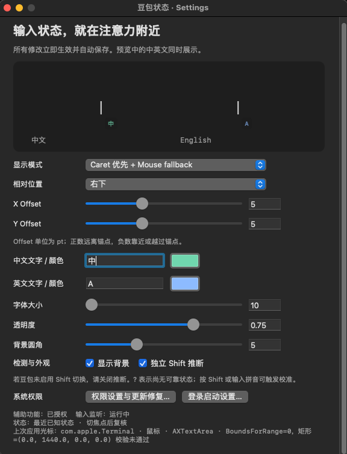
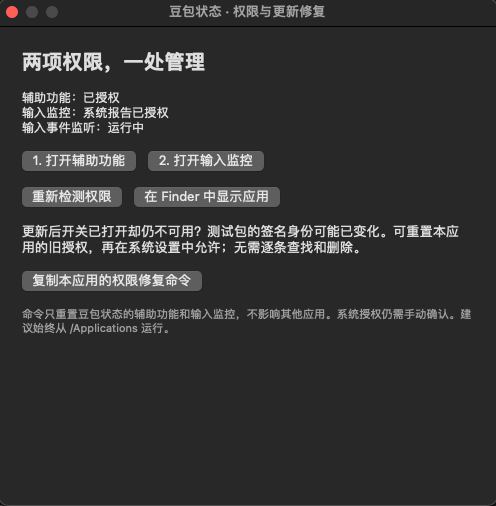

<p align="center"></p>

# 豆包状态 · DoubaoCaret

**中文** | [English](README.en.md)

在输入光标或鼠标附近显示豆包输入法的 **中 / A**，减少写代码时猜测输入模式的打断。

Swift + AppKit 原生 macOS 菜单栏应用，无 Dock 图标，无第三方运行时依赖。支持 **macOS 13+、Apple Silicon 和 Intel**。

> 当前为早期版本。Caret 覆盖取决于应用的辅助功能实现；未取得可靠位置时自动跟随鼠标。完整的应用兼容性、状态准确率和 CPU 表现仍在验证中。

## 功能

- 观察豆包内部中英文模式，而不是仅监听系统输入源。
- **Caret 优先 + Mouse fallback**，或始终 **Follow Mouse**。
- 左上、右上、左下、右下；X/Y 偏移可用滑块和数值调整。
- 中英文分别设置文字、颜色；字体大小、透明度、背景和圆角可调。
- 设置实时预览，修改自动保存。
- 指示器不抢焦点、不接收鼠标事件；尝试支持多屏、Space 和全屏应用。
- 启用/停用、登录启动、手动校准、权限修复、可复制诊断。

## 界面截图

**设置与实时预览**：调整跟随模式、相对位置、X/Y 偏移，以及中英文文字、颜色和外观。顶部预览同时展示两种状态，修改立即生效并自动保存。



**权限与更新修复**：查看辅助功能和输入监控状态，打开对应系统设置，或复制本应用的权限修复命令。重置后仍需在系统设置中手动授权。



## 下载与安装

1. 在本仓库 **[Releases](../../releases)** 下载 `DoubaoCaret-v<版本>-macos-universal.zip`。
2. 解压，将 `DoubaoCaret.app` 移入 `/Applications`，打开应用。
3. 菜单 → **权限设置与更新修复**，分别授予 **辅助功能**和**输入监控**。
4. 选择豆包输入法，在文本框输入拼音或按 Shift 切换，让指示器取得状态证据。

应用只出现在菜单栏。首次启动会打开设置；系统要求重启时，请退出并重新打开应用。

### 首次打开被 macOS 拦截

请查看 Release 中的签名说明。默认自动发布的是 **ad-hoc 测试包，未经 Apple 公证**。确认下载来源后，先尝试打开，再进入 **系统设置 → 隐私与安全性 → 仍要打开**。详见 [Apple 官方说明](https://support.apple.com/102445)。

### 更新后权限失效

固定安装路径不能保证 ad-hoc 更新保留权限。新版菜单提供「重新检测权限」及「复制本应用的权限修复命令」，省去手动逐条查找旧授权。重置后仍需手动允许访问。见 [权限与签名指南](docs/PERMISSIONS.md)。

### 验证下载

把 ZIP 和同一 Release 的 `SHA256SUMS` 下载到一个目录：

```bash
shasum -a 256 --ignore-missing -c SHA256SUMS
```

应看到下载的 ZIP 显示 `OK`。校验和用于检测损坏；它不能替代对发布来源的信任。

## 使用

| 设置 | 行为 |
|---|---|
| Caret 优先 | 使用应用提供的有效插入点坐标；取不到时跟随鼠标 |
| Follow Mouse | 始终跟随鼠标，不查询 caret |
| 相对位置 | 左上 / 右上 / 左下 / 右下 |
| X / Y Offset | 单位 pt；正数远离锚点，负数靠近或越过锚点 |
| 文字 / 颜色 / 外观 | 中英文分别配置，预览即时更新 |
| 校准为中文 / 英文 | 只校准指示器，不发送按键、不改变输入法 |
| Launch at Login | 通过系统登录项注册，从固定安装路径启动 |

**`?` 表示未知，不代表英文。** 首次启动、输入源变化或事件中断后需要重新校准。切应用且输入源未变时暂时保留最近已知状态并复核。不是豆包时隐藏指示器，菜单显示 `—`；安全输入时隐藏指示器。

## 检测原理与限制

以豆包自己的 AX「中 / 英」提示为主要证据，辅以近期输入后的候选窗中文证据和独立 Shift 推断。菜单注明证据来源。**没有候选窗不会被推断为英文。** 如果豆包关闭了 Shift 切换，请在本工具中关闭「独立 Shift 推断」。

目前未确认可直接查询豆包内部模式的公开 API。无可访问提示、候选窗或输入事件时，不能保证立即识别；若豆包按应用恢复不同状态，切焦点后沿用的状态可能要等新证据纠正。

第一阶段面向 VS Code、Cursor、Terminal/iTerm、Chrome/Safari 和 JetBrains。它们均使用相同的可靠坐标优先策略，**这份列表不是已通过真机测试的兼容性承诺**。VS Code/Cursor 会按需请求 Electron 的辅助功能暴露，不修改编辑器配置文件。

若始终只跟随鼠标：确认 Caret 优先与辅助功能已开启，在目标应用输入后，点击菜单 **复制上次应用的光标诊断**，附到 Issue 中。

## 隐私与性能

运行时不联网、不上传遥测、不记录键入文字，不读取文本框内容或剪贴板；只有点击复制诊断/修复命令时才写入剪贴板。全局事件监听是只读的，不拦截或注入按键。AX 查询只访问焦点链及豆包提示的小范围子树，不高频扫描整棵 Accessibility Tree。

事件通知优先，鼠标更新合并到最高 60 次/秒；caret 有每秒一次轻量 fallback，豆包空闲窗口检查每 2 秒一次。停用或会话暂停时停止周期工作。CPU/耗电目标仍需实测，见 [验收步骤](docs/VALIDATION.md)。

## 开发与发布

macOS（安装 Xcode Command Line Tools）：

```bash
bash scripts/test-core.sh
bash scripts/build-macos.sh
python3 scripts/verify-artifact.py dist/DoubaoCaret.app
open dist/DoubaoCaret.app
```

Linux x86_64 交叉编译：

```bash
bash scripts/setup-cross.sh
bash scripts/build-linux.sh
```

构建结果在 `dist/`。完整环境、测试和目录说明见 [开发指南](docs/DEVELOPMENT.md)。

GitHub Actions 包含 PR/分支 CI 和标签发布；推送与应用版本匹配的 `v0.1.2` 标签会构建通用包、生成中英文 Release 说明和 SHA-256，并创建 Release。默认不需要自定义 Secret；可选固定 Developer ID 签名和公证。

**首次建仓库、标签发布及 Secrets 配置：[发布指南](docs/RELEASING.md)。**

## 参与与许可证

欢迎提交 [Issue](../../issues) 和 PR。请提供 macOS、应用/豆包版本及不含敏感内容的诊断。见 [贡献指南](CONTRIBUTING.md)、[安全说明](SECURITY.md) 和 [更新日志](CHANGELOG.md)。

项目使用 [MIT](LICENSE)。豆包检测策略参考并改写自 [jianzhoujz/input-indicator](https://github.com/jianzhoujz/input-indicator)（MIT，© 2026 Jian Zhou）；[原许可证](THIRD_PARTY_LICENSES/input-indicator.txt)随应用分发。Lang Cursor 仅为交互参考，未复制其代码或资产。图标由 AI 生成，见 [图标说明](docs/ICON.md)。本项目与豆包/字节跳动无隶属关系，不附带豆包输入法。Apple SDK 不随仓库或 Release 分发。
